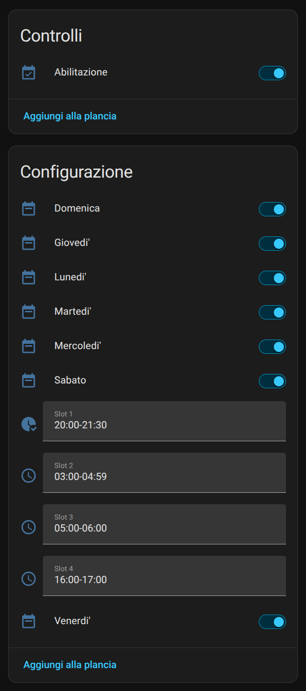
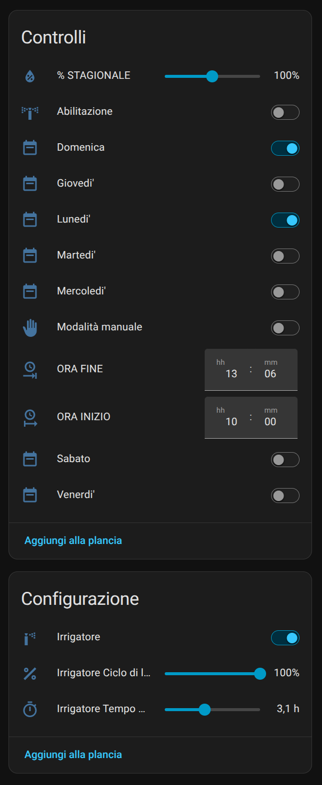
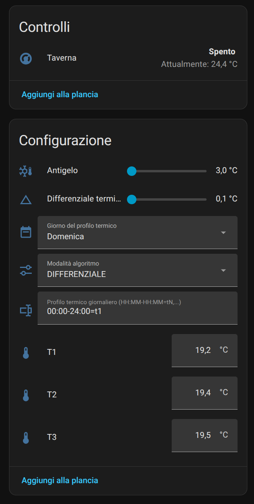
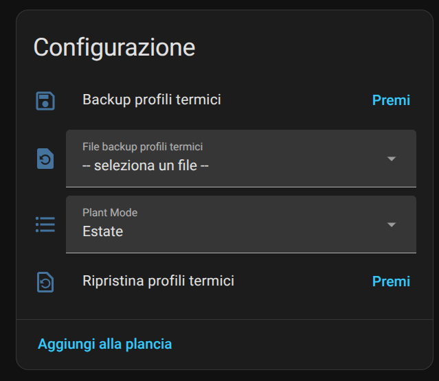
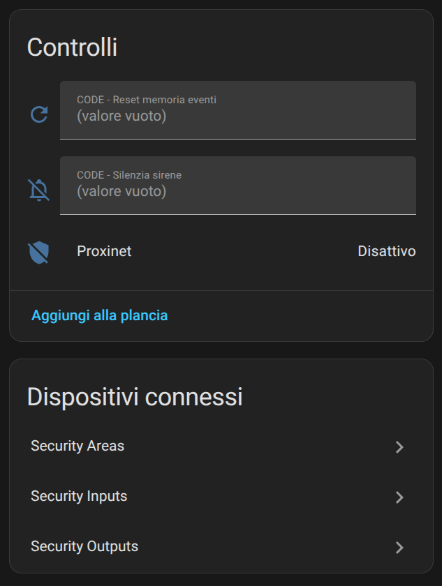
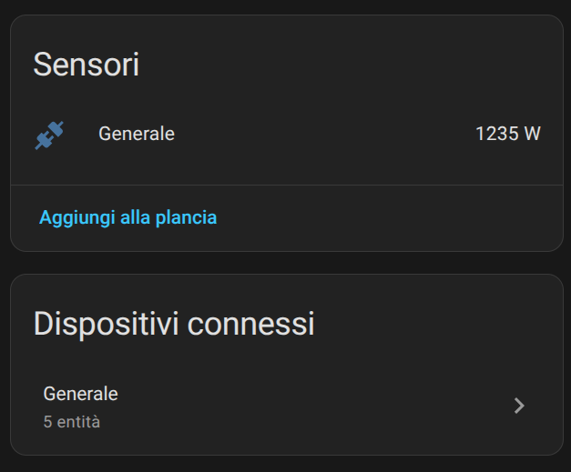
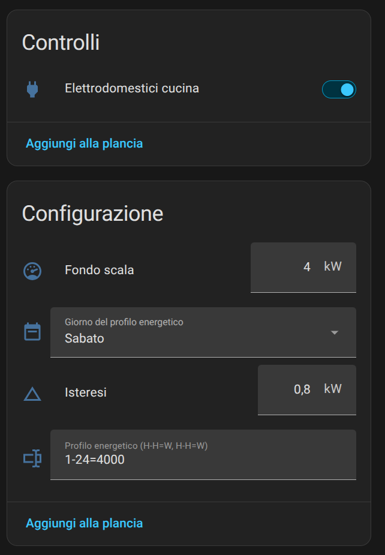

### 🌐 Lingua / Language
- [Italiano](Changelog.it.md) | [English](Changelog.md)

# Changelog

Tutte le modifiche rilevanti a questo progetto sono documentate in questo file.

---

## [1.0.0] - 2026-03-12

### 🚀 Features

- Rilascio pubblico iniziale dell'**integrazione ETI/DOMO per Home Assistant**
- Gateway di comunicazione con i sistemi ETI/Domo tramite l'**interfaccia web Home Sapiens**

#### Piattaforme supportate
- Attuazioni
- Ingressi analogici
- Controllo climatico
- Contatori energia
- Fan coil
- Centrale antintrusione
- Luci
- Scenari

## [1.1.0] - 2026-04-04

### 🚀 Features

#### Piattaforme supportate
- TVCC
- Aperture
- Ingressi digitali

## [1.1.1] - 2026-04-09

### 🐛 Bug Fixes

## [1.2.0] - 2026-04-12

### 🚀 Features

- Aree di sicurezza
- Ingressi di sicurezza
- Uscite di sicurezza

## [1.3.0] - 2026-04-12

### 🚀 Features

- Notifiche di stato Offline/Online per il server ETI/DOMO

## [1.3.1] - 2026-06-21

### 🐛 Bug Fixes

- Corretta la modalità estiva del termostato

## [1.4.0] - 2026-07-11

### 🚀 Features

#### Esposizione profili termici della modalità automatico

- **Esposizione del profilo termico** per le entità climate
- **Decodifica leggibile del profilo**: nuovo attributo `thermal_profile_schedule` che condensa i 96 slot da un quarto d'ora in intervalli di tempo compressi (es. `00:00-09:00: t3 | 30.0°C`), una riga per intervallo, pronto per una consultazione rapida e per le automazioni.
- **Set-point attivo corrente**: nuovo attributo `scheduled_setpoint`, calcolato in tempo reale dal profilo termico in base all'orario corrente — utile per sapere "a che temperatura dovrebbe essere adesso" senza dover consultare lo scheduler.
- **Attributi di stato più leggibili**: `mode` e `status` ora restituiscono etichette testuali invece dei codici numerici grezzi.
- **Aggiornamento automatico del profilo al riavvio**: i termostati già in modalità AUTO ora richiedono attivamente il profilo termico completo e lo espongono immediatamente.

#### Comportamento della card Climate

- **La modalità AUTO ora mostra il set-point programmato** sulla card nativa (numero + slider), invece di mostrare solo il testo "Automatico" — coerente con il comportamento standard delle altre integrazioni climate di Home Assistant.
- **La modalità OFF (solo in inverno) mostra il valore antigelo** (`antifreeze`) sulla card, invece di bloccare qualsiasi interazione. In estate rimane "Off" senza slider, poiché il concetto di antigelo non si applica al raffrescamento.
- **Interazione assistita**: se l'utente muove lo slider mentre il termostato è in modalità AUTO o OFF (OFF solo in inverno), il termostato passa automaticamente in modalità **manuale** e applica immediatamente la temperatura richiesta, con una singola chiamata al gateway (mode + set_point in un unico comando).
- Nuovo attributo `antifreeze` (°C) esposto sull'entità.

### 🐛 Bug Fixes

- **Merge pull request #4 da brokkolo/patch-1**: Corretti i falsi cali a 0°C nella cronologia: le entità climate impostavano di default temp_dec/set_point a 0/200 invece di None

## [1.5.0] - 2026-07-17

### 🚀 Features

#### Centrale Antintrusione

Gestione dell'inserimento quando una o più aree dello scenario richiesto non sono pronte (ingressi aperti), per evitare che l'allarme scatti immediatamente.

##### Comportamento Implementato

Quando l'utente richiede l'inserimento (arm_home / arm_night / arm_away) e una o più aree coinvolte nello scenario non sono pronte:

1. Il comando **non** viene inviato immediatamente alla centrale.
2. Inizia un periodo di attesa di **30 secondi**, durante il quale l'entità mostra lo stato ARMING.
3. Viene inviata una notifica push a tutti i dispositivi mobili insieme a una notifica persistente in Home Assistant: *"⚠️ Inserimento in attesa"*.
4. Se le aree diventano pronte prima dello scadere dei 30s → l'inserimento procede immediatamente e la notifica viene rimossa.
5. Se i 30s scadono e le aree non sono ancora pronte → l'inserimento **viene comunque eseguito**, come richiesto dall'utente che era stato avvisato.
6. Se l'utente invia il disinserimento durante l'attesa → la richiesta di inserimento viene annullata, nessun comando viene mai inviato alla centrale. La notifica persistente viene rimossa; la notifica push rimane sul telefono finché non viene cancellata manualmente dall'utente (scelta esplicita, nessun richiamo automatico).

##### Notifiche Push per i Cambi di Stato della Centrale

1. Aggiunto sistema di notifiche push che informa l'utente di ogni cambio di stato della centrale.

#### Gestione timers

1. Gestione timer (piattaforma Scheduler)
- Eesposizione dei timer/programmazioni delle attivazioni (relè) come attributi entità #2

### 🐛 Bug Fixes

- [Bug] stato di alarm_control_panel bloccato su "unknown" dopo il riavvio — stato della centrale mai interrogato durante il discovery
 #3
 
## [1.6.0] - 2026-07-26

### 🚀 Features

#### Piattaforma Irrigazione

Supporto completo alla piattaforma di irrigazione, con esposizione di tutte le funzionalità native di gestione dell'irrigazione come entità Home Assistant.

##### Settori di Irrigazione

- Abilita/disabilita settore di irrigazione
- Percentuale di durata dell'irrigazione rispetto alla durata nominale programmata
- Configurazione della programmazione settimanale con abilitazione/disabilitazione individuale per ogni giorno
- Orario di avvio irrigazione configurabile
- Stato irrigazione che indica se il ciclo di irrigazione corrente è stato avviato manualmente o automaticamente da programmazione
- Avvio/arresto manuale dell'irrigazione

##### Irrigatori

- Abilita/disabilita singolo irrigatore
- Tempo massimo di irrigazione configurabile
- Percentuale di duty cycle configurabile
- Stato operativo in tempo reale mostrato direttamente sull'entità switch tramite un'icona dinamica

#### Piattaforma Climate

##### Programmazione Termica Settimanale

Aggiunta la gestione completa della programmazione termica settimanale direttamente da Home Assistant, in linea con le funzionalità disponibili nell'interfaccia nativa.

- Entità selettore giorno sincronizzata automaticamente con il profilo termico attivo
- Profilo giornaliero modificabile tramite un formato di intervalli orari leggibile
- Caricamento diretto delle programmazioni modificate sul termostato

I seguenti parametri sono ora esposti sia in lettura che in scrittura:

- Antigelo
- Differenziale termico
- Giorno profilo termico
- Modalità algoritmo
- Profilo termico giornaliero
- T1 / T2 / T3

#### Backup e Ripristino Profili Termici

##### Backup

- Nuovo pulsante **Backup Profili Termici**
- Salva i set-point T1/T2/T3 e le programmazioni settimanali di ogni termostato
- File di backup salvati in `config/thermo_profile_bk/`
- Generazione automatica del nome file stagionale (inverno/estate)

##### Ripristino

- Selettore automatico dei file di backup
- Filtro stagionale che previene il ripristino di profili incompatibili
- Nuovo pulsante **Ripristina Profili Termici**
- Verifica automatica di ogni termostato ripristinato
- Stato di avanzamento/completamento temporaneo mostrato direttamente dal selettore
- I termostati mancanti nell'impianto vengono saltati con un avviso, senza interrompere il processo di ripristino

### 🐛 Bug Fixes

- Aggiunto filtraggio anti-glitch durante la programmazione del bus ETI/DOMO per scartare valori `temp_dec` non validi (fuori dal range 3–35°C) e valori `hygro` non validi (fuori dal range 0–100%), evitando che letture di temperatura e umidità non valide si propaghino alle entità Climate.
- La centrale allarme ora espone solo gli scenari effettivamente configurati nell'impianto. **Away** è sempre disponibile, mentre **Night** e **Home** vengono create solo quando i rispettivi scenari esistono e contengono aree configurate.
- Corretto un problema per cui, su alcuni impianti l'app poteva mostrare il pulsante sbagliato al posto di "resto in casa" (es. "notte"). Ora il sistema riconosce ogni scenario dal suo nome reale sulla centrale, non da un ordine fisso presunto.
- Aggiunto il riconoscimento automatico di eventuale scenario "custom" configurato sulla centrale, che prima non veniva gestito.

## [1.7.0] - 2026-08-02

### 🎉 Novità distribuzione

- L'integrazione è stata inserita nel catalogo ufficiale di HACS. 
D'ora in poi è installabile con una semplice ricerca, senza configurazioni aggiuntive.

### 🚀 Features

- Allarme, tacitazione sirena: Nuovo comando per tacitare la sirena dell'allarme direttamente da Home Assistant, digitando il proprio codice su un'apposita entità testuale.

- Allarme, cancellazione memoria eventi: Nuovo comando per azzerare la memoria degli eventi di allarme registrati dalla centrale, direttamente da Home Assistant, digitando il proprio codice su un'apposita entità testuale.

### 🐛 Bug Fixes

- SecurityEventsLogger ora utilizza un percorso di log portabile tramite hass.config.path() invece di un percorso /config fisso, e le operazioni di I/O su file (creazione directory, scrittura log) vengono eseguite in un executor per non bloccare il event loop.

## [1.8.0] - 2026-08-20

### 🚀 Features

#### Climate - Copia/incolla profili termici, Profilo Jolly, modalità impianto spento

- Aggiunto select "Copia profilo termico su" per ogni termostato: permette di copiare il profilo del giorno correntemente selezionato su un altro giorno specifico o su tutta la settimana.
- Gestione del profilo Jolly esposto come preset mode sulla climate card
- Quando l'impianto è spento, la card climate non mostra pulsanti inutilizzabili.

#### Nuova piattaforma Controllo Carichi

- Gestione completa in lettura/scrittura dei carichi controllati, esposte entità: abilitazione carico, profilo energetico settimanale, fondo scala, isteresi, sensore potenza.

